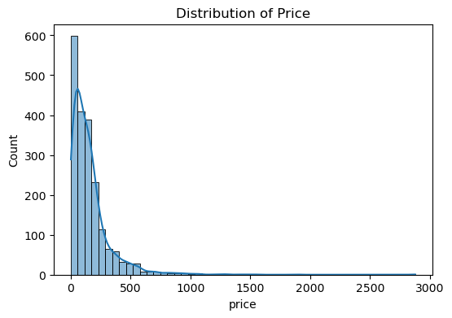
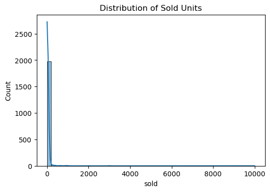
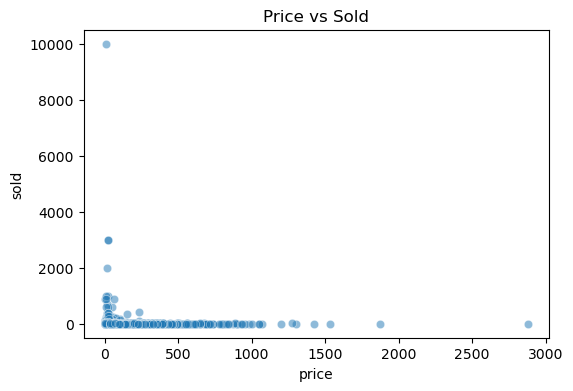
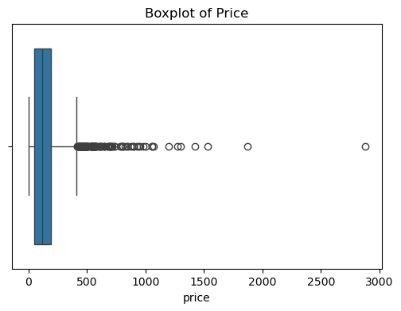
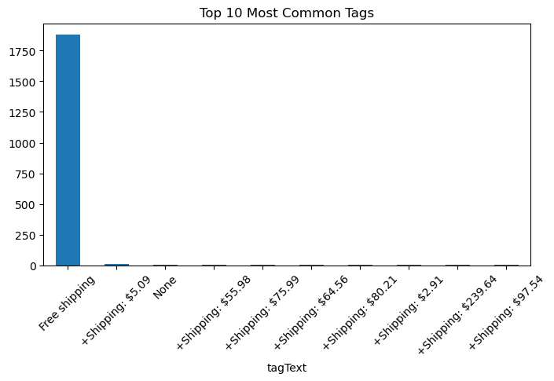

# AliExpress Furniture Sales Analysis  

##  Project Overview  
This project analyzes **2,000 AliExpress furniture products** to explore pricing, discounts, and sales patterns.  
The main objective was to build a model to **predict the number of units sold (`sold`)** using product attributes such as price, discount, and tags.  

---

##  Dataset Overview  
- **Rows:** 2,000 products  
- **Columns:**  
  - `productTitle` → Name of item  
  - `originalPrice` → Price before discount  
  - `price` → Current selling price  
  - `sold` → Units sold  
  - `tagText` → Tags (e.g., Free shipping, discounts)  

The dataset was scraped from AliExpress (via Apify) and ethically collected.  

---

## ⚙️ Tech Stack  
- **Python**  
- **pandas, numpy** → Data preprocessing  
- **matplotlib, seaborn** → Visualization  
- **scikit-learn** → Machine Learning models  

---

##  Exploratory Data Analysis (EDA)  

### 🔹 Price Distribution  
Most products are low-cost, with a few expensive outliers.  

  

### 🔹 Sold Units Distribution  
Most items have low sales; few products dominate the sales.  

  

### 🔹 Price vs Sold  
No clear linear relationship between price and sales.  

  

### 🔹 Boxplots (Outliers)  
Extreme outliers exist in both price and sold.  

  

### 🔹 Most Common Tags  
"Free Shipping" and discount-related tags appear frequently.  

  

##  Feature Engineering  
- `title_length` → number of characters in product title  
- `discount_percent` → calculated from original vs discounted price  
- Encoded `tagText` using Label Encoding  

---

## Model Training & Results  

| Model                   | R² Score  | MAE   |
|--------------------------|-----------|-------|
| Linear Regression        | **0.0057** | 29.66 |
| Random Forest Regressor  | **-8.36**  | 42.26 |

 Both models performed poorly → available product attributes are **not strong predictors** of sales.  

## Key Insights  
- **Price & discounts alone don’t explain sales.** External factors (reviews, ratings, brand trust) likely matter more.  
- **Outliers affect performance** — data cleaning could improve results.  
- **TagText & ProductTitle** hold valuable info, but require **NLP methods** (TF-IDF, embeddings).  

##  Future Work  
- Apply **text analysis (TF-IDF/embeddings)** on `productTitle` & `tagText`.  
- Use **advanced ML models** (XGBoost, CatBoost, LightGBM).  
- Incorporate external features: customer reviews, ratings, seller reputation.  
- Perform **category-wise analysis** (chairs, sofas, tables, etc.).  
- Add **time-series analysis** if temporal data is available.  

